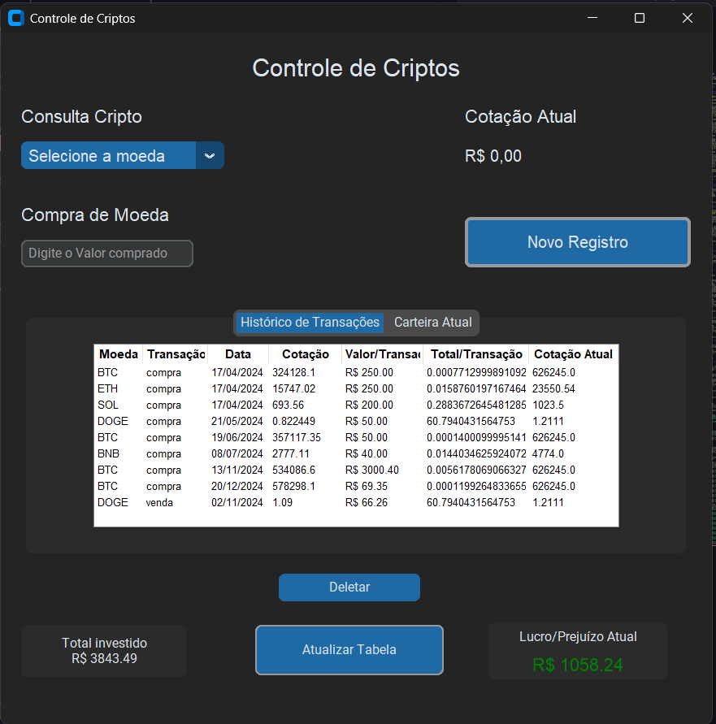

# 📊 Controle de Investimentos em Criptos

  
  
  

Projeto desenvolvido para ajudar no **controle de carteiras de investimento em criptomoedas**.  
O aplicativo se conecta à **API pública da Binance** para buscar cotações em tempo real, permitindo acompanhar o desempenho das transações e visualizar o **lucro ou prejuízo total**.

---

## 📋 Tabela de Conteúdos
- [Sobre o Projeto](#-sobre-o-projeto)
- [Funcionalidades](#-funcionalidades)
- [Como Usar](#️-como-usar)
- [Capturas de Tela](#-capturas-de-tela)
- [Autor](#-autor)

---

## 📝 Sobre o Projeto

Este aplicativo começou como um projeto pessoal para praticar conceitos de **Python**.  
A inspiração veio da necessidade de ter um **controle mais fácil dos meus próprios investimentos em criptomoedas**, sem ter que alternar entre aplicativos e planilhas.

O programa:
- Lê os registros de transações de um arquivo local  
- Exibe os valores automaticamente  
- Calcula o **lucro ou prejuízo**  

Com o tempo, foram adicionadas novas funcionalidades, como:
- 📝 Registro direto de novas compras e vendas  
- 📑 Histórico de transações em tabela interativa  
- 💰 Visão geral da carteira com saldo total de cada moeda  
<br/>
> ⚠️ O projeto ainda está em desenvolvimento, mas já é **totalmente funcional** para registro e acompanhamento de transações.

---

## ✨ Funcionalidades

✅ **Consulta de Cotação em Tempo Real:** Conecta-se à API da Binance para obter a cotação atual das criptomoedas.  
✅ **Registro de Transações:** Adicione novas compras e vendas de criptomoedas.  
✅ **Histórico de Transações:** Visualize todas as suas operações em uma tabela organizada.  
✅ **Controle de Carteira:** Veja o saldo atual de cada criptomoeda, o custo médio e o lucro ou prejuízo total.  
✅ **Interface Intuitiva:** Desenvolvido com a biblioteca **CustomTkinter** para uma experiência de usuário limpa e moderna.  

---

## ⚙️ Como Usar

Siga os passos abaixo para rodar o projeto localmente:

### 1️⃣ Clone o Repositório
```bash
git clone https://github.com/EvandroBaraka/projeto-controle-de-investimentos-cripto
```

### 2️⃣ Crie e Ative o Ambiente Virtual
```bash
python -m venv .venv
# Windows
.venv\Scripts\activate
# macOS/Linux
source .venv/bin/activate
```

### 3️⃣ Instale as Dependências
```bash
pip install -r requirements.txt
```

### 4️⃣ Execute o Programa
```bash
python main.py
```

---

## 📸 Capturas de Tela




---

## 👤 Autor

👨‍💻 **Evandro Passaia**  
- GitHub: [@EvandroBaraka](https://github.com/EvandroBaraka)  
- LinkedIn: [Evandro Passaia](https://www.linkedin.com/in/evandro-passaia-62b9a5269/)  
- Facebook: [Evandro Passaia](https://www.facebook.com/evandro.passaiaze/)  

---
📜 Licença: Este projeto está sob a licença [MIT](LICENSE).  
